<div align="center">

# 🔥 Ember &amp; Oak

### A wood-fired bistro, served on the web.

A production-grade marketing & reservations site for a 32-seat seasonal restaurant —
fast, accessible, richly animated, and SEO-perfect down to the JSON-LD.
Built one-shot with the Next.js App Router, fully typed, zero runtime dependencies beyond React.

<br />

[](https://nextjs.org/)
[](https://react.dev/)
[](https://www.typescriptlang.org/)
[](https://tailwindcss.com/)
[](https://playwright.dev/)
[](#-license)

<br />

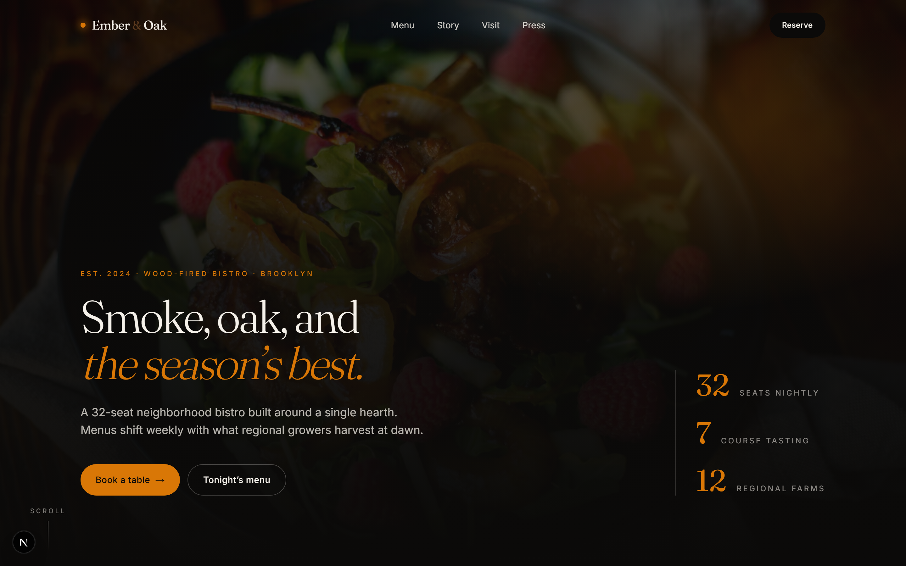

</div>

---

## ✨ Overview

**Ember & Oak** is a single-page restaurant experience with a real reservations backend.
Diners land on a cinematic hero, scroll through hearth-fired menu sections, and book a table
through a multi-step modal that checks live seat availability before confirming. Every section
is server-rendered, every interaction is keyboard-accessible, and the whole page ships a complete
`Restaurant` + `Menu` Schema.org graph for rich search results.

> No SaaS dashboards, no third-party booking widgets — the booking flow, availability engine,
> mailer, and admin console are all part of this codebase.

---

## 📸 Screenshots

### 🏠 The home page — section by section

<p align="center">
  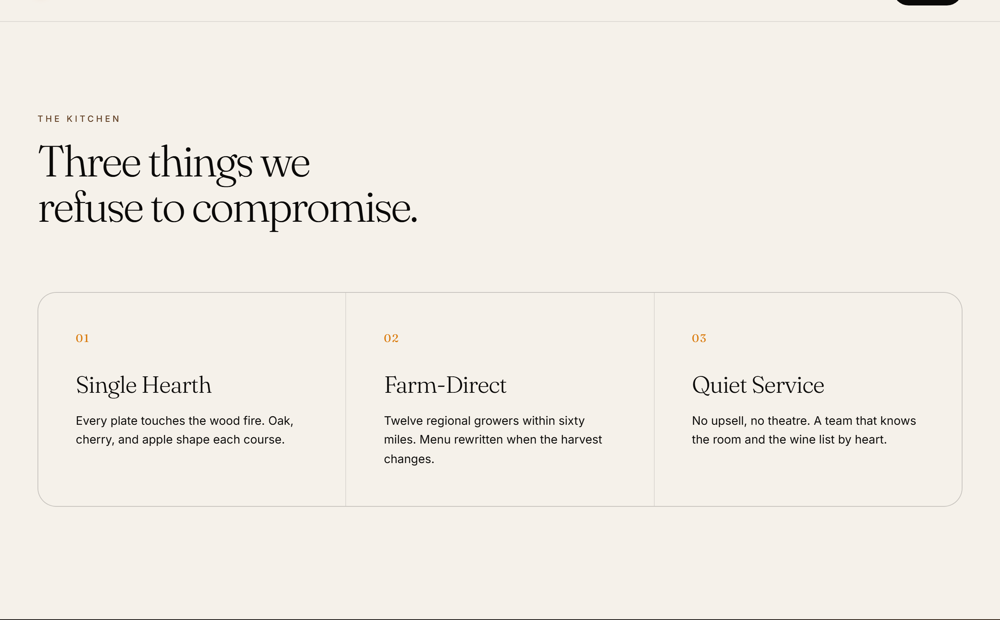
  <br /><sub><b>Pillars</b> · the kitchen's three promises</sub>
</p>

<p align="center">
  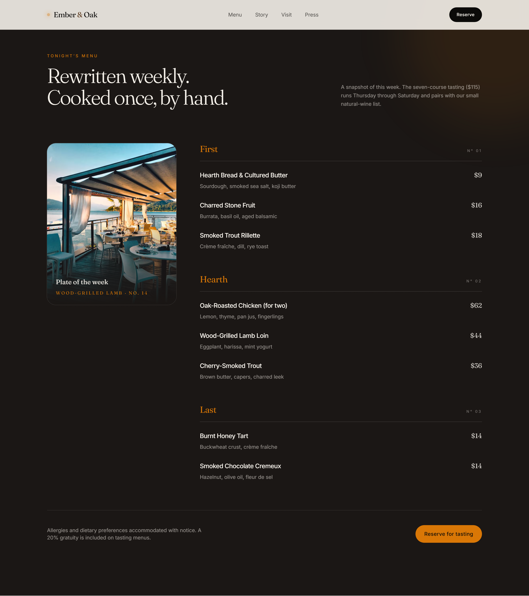
  <br /><sub><b>Menu</b> · this week's courses with a featured “plate of the week”</sub>
</p>

<p align="center">
  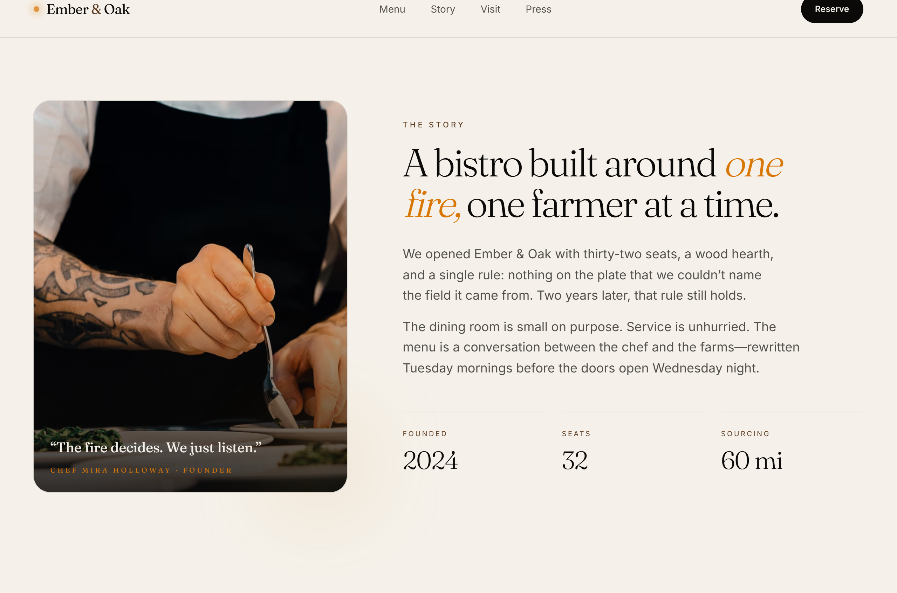
  <br /><sub><b>Story</b> · founder, ethos, and at-a-glance stats</sub>
</p>

<p align="center">
  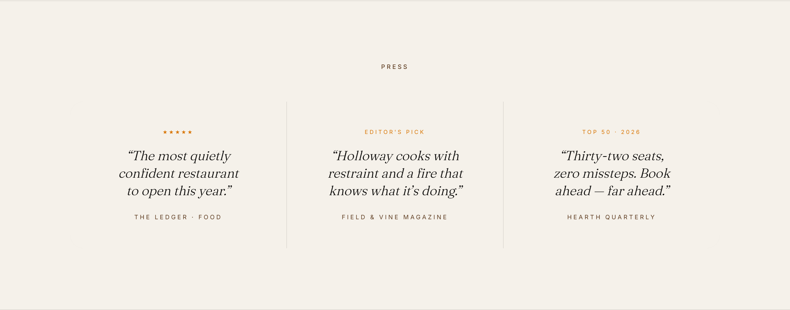
  <br /><sub><b>Press</b> · editorial pull-quotes</sub>
</p>

<p align="center">
  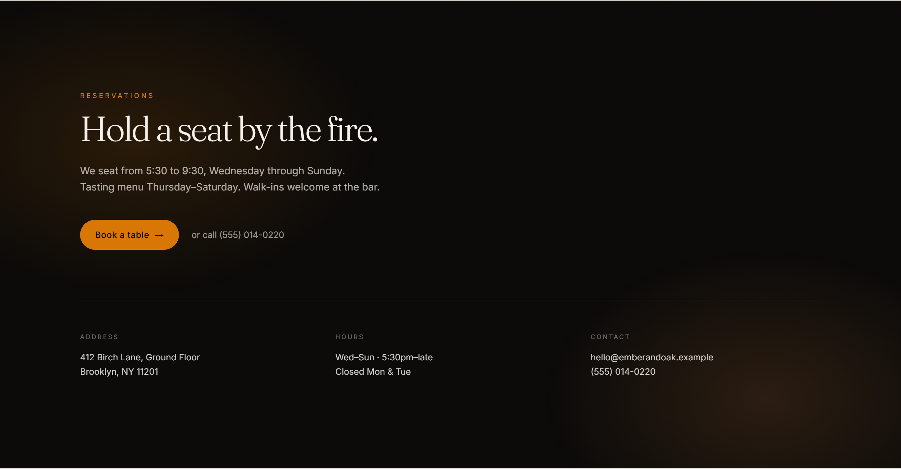
  <br /><sub><b>Reserve</b> · hours, address, and the booking CTA</sub>
</p>

<p align="center">
  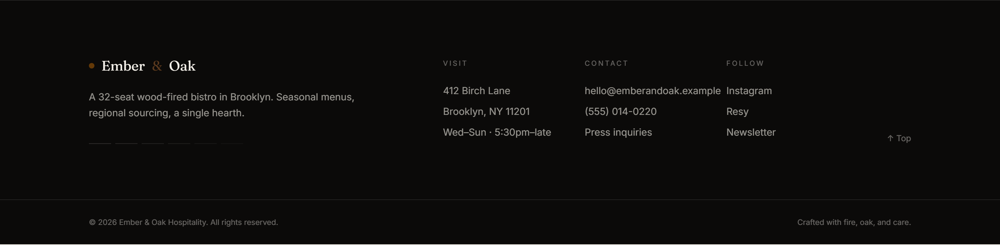
  <br /><sub><b>Footer</b> · visit, contact, and social</sub>
</p>

<p align="center"><sub>📜 <a href="docs/screenshots/home-full.png">See the entire page in a single scroll →</a></sub></p>

### 🗓️ Booking flow & reservations

<table>
  <tr>
    <td width="50%" align="center">
      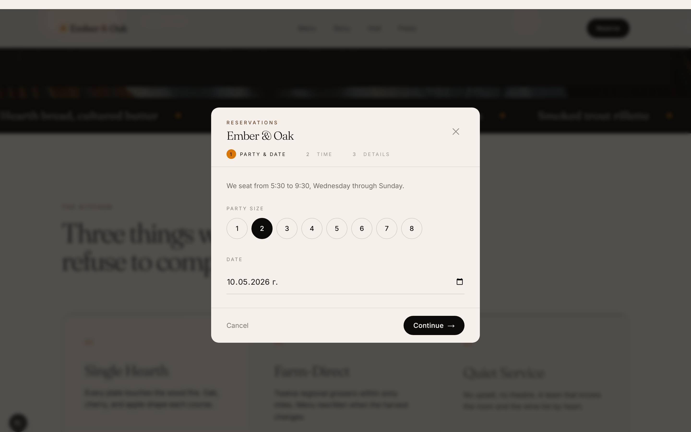<br />
      <sub><b>Booking — step 1 · party &amp; date</b></sub>
    </td>
    <td width="50%" align="center">
      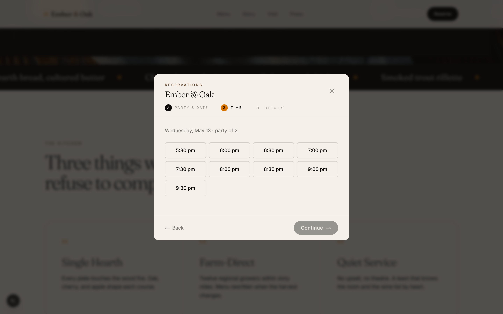<br />
      <sub><b>Booking — step 2 · live availability</b></sub>
    </td>
  </tr>
  <tr>
    <td colspan="2" align="center">
      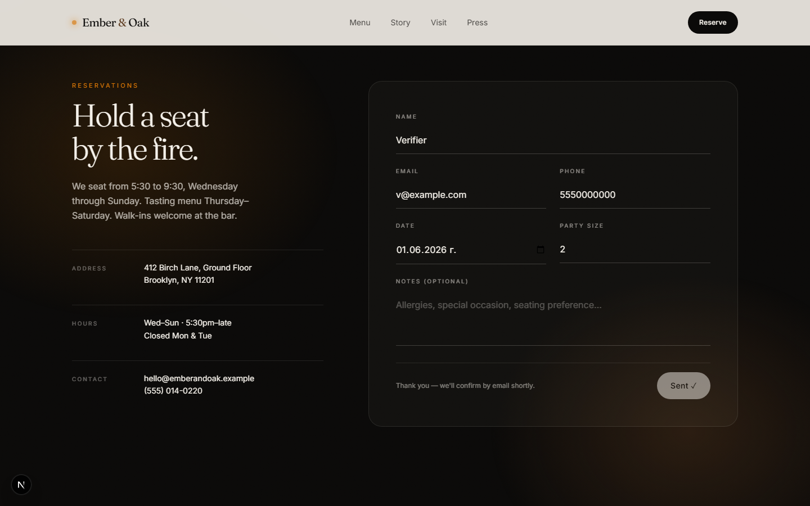<br />
      <sub><b>Reservations section · server-validated form with confirmation state</b></sub>
    </td>
  </tr>
</table>

### 📱 Mobile

<table>
  <tr>
    <td width="50%" align="center">
      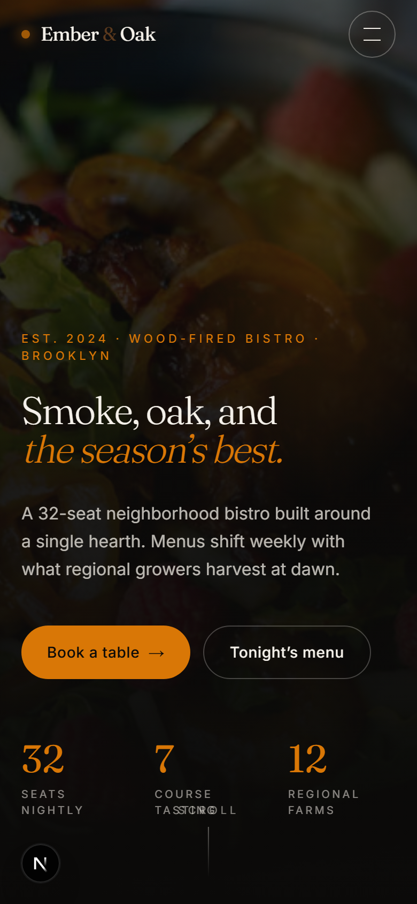<br />
      <sub><b>Mobile · hero</b></sub>
    </td>
    <td width="50%" align="center">
      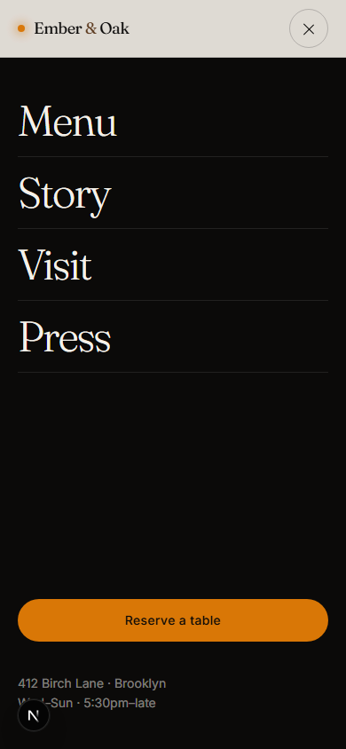<br />
      <sub><b>Mobile · full-screen nav</b></sub>
    </td>
  </tr>
</table>

---

## 🎯 Key Features

### 🎨 Modern, hand-tuned UI
- **Cinematic landing page** — hero, scrolling flavor marquee, pillars, menu, story, press, and reservations, composed as discrete sections.
- **Brand design system** — custom Tailwind tokens (`ink`, `bone`, `ember`, `oak`, `char`), a `Fraunces` display / `Inter` sans pairing, and reusable `@layer components` utilities (`btn`, `eyebrow`, `h-display`).
- **Motion that respects the user** — CSS `rise`/`glow` keyframes plus an `IntersectionObserver`-driven `Reveal` component for scroll-in animations — no heavy animation library, and honors `prefers-reduced-motion`.
- **Fully responsive** — fluid layouts verified across desktop, tablet, and mobile breakpoints.

### 🗓️ Real reservations backend
- **Multi-step booking dialog** built on the native `<dialog>` element — party size → date → live time-slot lookup → details → confirmation.
- **Availability engine** (`lib/slots.ts`) — generates 30-minute service slots, enforces service days, and caps seats per slot to prevent overbooking.
- **Server-side validation** on every API route (email, ISO date, valid slot, party size, seat-conflict 409s).
- **Double opt-in confirmation** flow with per-reservation confirm tokens.
- **Newsletter** and **press inquiry** capture endpoints.
- **Stub mailer** that records every outbound message to an inspectable mailbox.
- **Admin console** at `/admin` — token-gated view of reservations, subscribers, press, and the mailbox.

### 🔎 SEO & accessibility, built in
- Full **Next Metadata API** setup: title templates, Open Graph, Twitter cards, robots, theme color.
- A complete **JSON-LD `@graph`** — `Restaurant`, `Menu`, `WebSite`, `WebPage`, `BreadcrumbList` — with hours, geo, ratings, and per-dish offers.
- Generated `sitemap.xml`, `robots.txt`, `manifest.webmanifest`, dynamic OG image, and favicons.
- Semantic landmarks, skip-to-content link, labelled `nav`s, and `focus-visible` rings throughout.

### 🧪 Verified
- Strict **TypeScript**, clean **ESLint** (Next core-web-vitals), and a green **production build**.
- **Playwright** scripts capture responsive screenshots, smoke-test the booking flow, and validate the JSON-LD graph.

---

## 🏗️ Tech Stack

| Layer        | Technology                                                        |
| ------------ | ----------------------------------------------------------------- |
| Framework    | **Next.js 16** (App Router, React Server Components, Turbopack)    |
| UI runtime   | **React 19**                                                      |
| Language     | **TypeScript 5.5** (`strict`)                                      |
| Styling      | **Tailwind CSS 3.4** + PostCSS + Autoprefixer                     |
| Data store   | **File-based JSON** (`data/db.json`) with an atomic, queued writer |
| Tooling      | **ESLint 9** (flat config) · **Playwright** verification scripts   |

> **On the data layer:** persistence is a zero-dependency JSON store, ideal for demos and a single
> long-running Node server. For serverless/multi-instance production, swap `lib/db.ts` for a managed
> database — see [Deployment](#-deployment).

---

## 📂 Project Structure

```text
ember-and-oak/
├── app/                          # Next.js App Router
│   ├── api/                      # Route handlers (server-only)
│   │   ├── availability/         #   seat availability + slot lookup
│   │   │   ├── route.ts
│   │   │   └── slots/route.ts
│   │   ├── newsletter/route.ts   #   newsletter signups
│   │   ├── press/route.ts        #   press inquiries
│   │   └── reservations/         #   booking + email confirmation
│   │       ├── route.ts
│   │       └── confirm/route.ts
│   ├── admin/page.tsx            # token-gated admin console
│   ├── layout.tsx               # metadata, fonts, root shell
│   ├── page.tsx                 # landing page + JSON-LD graph
│   ├── globals.css              # Tailwind layers + design tokens
│   ├── icon.tsx · apple-icon.tsx · opengraph-image.tsx
│   ├── manifest.ts · robots.ts · sitemap.ts
├── components/                   # One file per section / UI piece
│   ├── Nav.tsx · Hero.tsx · Marquee.tsx · Pillars.tsx
│   ├── Menu.tsx · Story.tsx · Press.tsx · Reserve.tsx · Footer.tsx
│   ├── BookingDialog.tsx · BookingTrigger.tsx   # reservation modal
│   └── Reveal.tsx                                # scroll-in animations
├── lib/                          # Framework-agnostic logic
│   ├── db.ts                     # atomic JSON store + types
│   ├── mail.ts                   # stub mailer → mailbox
│   ├── slots.ts                  # availability / service-day engine
│   ├── menu.ts                   # menu data
│   └── site.ts                   # business profile / NAP details
├── data/                         # Runtime store (git-ignored, auto-created)
│   └── db.json
├── scripts/                      # Playwright verification + checks
│   ├── verify.mjs · dialog-shot.mjs · portfolio-shot.mjs · validate-ld.mjs
├── docs/screenshots/             # README imagery
├── public/                       # Static assets
├── .env.example                  # Environment template
├── eslint.config.mjs             # ESLint flat config
├── next.config.mjs · tailwind.config.ts · tsconfig.json
└── package.json
```

---

## 🚀 Getting Started

### Prerequisites
- **Node.js 18.18+** (Node 20 LTS recommended)
- **npm** (ships with Node)

### 1. Clone the repository
```bash
git clone https://github.com/<your-username>/ember-and-oak.git
cd ember-and-oak
```

### 2. Install dependencies
```bash
npm install
```

### 3. Configure environment variables
```bash
cp .env.example .env.local
```
Open `.env.local` and set a strong `ADMIN_TOKEN` (used to access `/admin`):
```bash
# generate a secure token
openssl rand -hex 32
```

> **Database migrations:** none required. The JSON store at `data/db.json` is created
> automatically on first write — there is nothing to migrate or seed.

### 4. Run the development server
```bash
npm run dev
```
Visit **[http://localhost:3000](http://localhost:3000)**.
The admin console lives at **`/admin?token=<your ADMIN_TOKEN>`**.

### 5. Production build
```bash
npm run build
npm start
```

### Available scripts
| Command             | Description                                            |
| ------------------- | ------------------------------------------------------ |
| `npm run dev`       | Start the dev server (Turbopack)                       |
| `npm run build`     | Create an optimized production build                   |
| `npm start`         | Serve the production build                             |
| `npm run lint`      | Run ESLint (Next core-web-vitals)                      |
| `npm run typecheck` | Type-check with `tsc --noEmit`                         |

---

## 🌐 Deployment

### Frontend — Vercel (recommended) or Netlify
The site deploys to any Next.js-capable host with **zero config**:

1. Push this repo to GitHub (see below).
2. Import the project into **[Vercel](https://vercel.com/new)** (or Netlify).
3. Add the `ADMIN_TOKEN` environment variable in the project settings.
4. Deploy — the framework preset is auto-detected.

### Persistence — moving off the JSON store
The default `data/db.json` store works on a single long-running Node server (e.g. a VM,
**Render**, **Railway**, or a Docker container). On **serverless platforms the filesystem is
ephemeral and read-only**, so reservations won't persist across invocations.

For production-grade persistence, swap the storage layer in **`lib/db.ts`** for a managed database
— the rest of the app talks only to `readDB()` / `writeDB()`, so the change is isolated:

- **[Supabase](https://supabase.com/)** or **[Neon](https://neon.tech/)** — managed PostgreSQL
- **[Vercel Postgres](https://vercel.com/storage/postgres)** / **Vercel KV** — first-party on Vercel
- Any provider with a Node driver or ORM (e.g. Prisma, Drizzle)

Wire the real mailer in **`lib/mail.ts`** (Resend, Postmark, SendGrid…) the same way.

---

## 📄 License

Released under the **MIT License**. Restaurant name, menu, imagery, and brand details are
fictional sample content.

<div align="center">
<br />
Built with 🔥 and the Next.js App Router.
</div>
